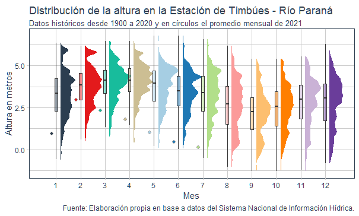

# Bajante del Río Paraná

## Importancia para la agroindustria y el país

El río Paraná forma parte de la Hidrovía Paraguay – Paraná, vía de navegación de 3.442 kilómetros que conecta los ríos Paraguay, Paraná, Uruguay y Río de la Plata, constituyéndose en un eje fundamental de la vinculación de Argentina con el resto del mundo.  

El río cuenta con ventajas naturales únicas. Atraviesa el corazón productivo de Argentina y cuenta con una barranca que reduce los costos de elevación. Además, gracias a su mínima inclinación no necesita de un sistema de esclusas. No obstante, requiere de dragado permanente para evitar la acumulación de sedimentos que limitan la profundidad del cauce. 

A partir del dragado a 28/32 pies (hoy 34) y de la mano de las inversiones en puertos y plantas de molienda, se ha convertido en la principal vía para las exportaciones e importaciones argentinas. El 60% de nuestro comercio exterior es transportado por este canal (USD 70.000 millones anuales). Actualmente, se embarca el 80% de los granos y subproductos, y circulan el 90% de los contenedores, la carga de las industrias automotriz y metalúrgica, y es una vía central para el abastecimiento energético del país.

## Situación actual: la bajante del río

Por la importancia descripta, la bajante que está experimentando el río enciende una señal de alarma. En el gráfico se representa con un punto la altura promedio mensual que se registró en la estación de Timbúes (3316) del Sistema Nacional de Información Hídrica en cada uno de los primeros 7 meses del año. Como puede apreciarse, si bien presentó un incremento en febrero, como consecuencia de las lluvias en el Sur de Brasil, en los meses siguientes la altura del río comenzó a disminuir, ubicándose sistemáticamente entre los valores más bajos de los últimos 120 años.

La comparación de la distribución de la altura para los primeros 7 meses del año desde 1980 hasta 2021 muestra que la bajante del río es un fenómeno que ya aconteció en 2020. Sin embargo, vemos que no se observan alturas tan bajas en todo el periodo graficado. La actual es una situación excepcional. Para alcanzar los 34 pies de calado es necesario una altura mínima de 2,47 metros, y durante el 2021 solamente se alcanzó esta profundidad en solo 80 días (25% del periodo).

## Consecuencias: Mayores costos y cambios en los flujos de transporte

Como resultado del menor caudal del río, se presentan dos opciones: los buques deben partir con una menor carga en bodega, afrontando el “falso flete”, o completar la carga en puertos de mayor calado como los de Bahía Blanca, Necochea o Brasil. En ambos casos, se incurre en mayores costos para transportar la misma cantidad de granos, afectando la competitividad del país. Aproximadamente, cada reducción de un pie de calado implica cargar 2.500 TM menos en un Panamax, y entre 1.500 y 1.800 TM en un Handysize o Handymax. 

Esta situación se refleja en los datos de camiones arribados a puertos. Históricamente, a los puertos del Gran Rosario llegan más del 70% de los granos que se transportan en camiones. Sin embargo, desde fines de marzo se observa un aumento en los camiones que llegan a los puertos de Bahía Blanca y Necochea. Estos arribos alcanzaron en junio su máximo histórico, y si bien en julio presentó una desaceleración mensual, todavía se ubican un 33% y 139% por encima del año pasado, respectivamente. 

Al observar el desagregado por grano del acumulado de camiones arribados al puerto de Bahía Blanca en los primeros 7 meses, se confirma que los flujos han cambiado en 2021. Se registran máximos de los últimos 8 años en cebada, girasol, maíz y trigo. Si bien en el caso del maíz se continúa con la tendencia creciente de campañas anteriores, en el resto de los granos los máximos son específicos de este año. 

En el caso de Necochea, se observan también en 2021 máximos acumulados de los últimos 8 años en girasol, maíz, sorgo y trigo. Si bien en girasol se continúa con la tendencia alcista, y en trigo se alcanzan volúmenes similares a 2017; en los casos de maíz y sorgo el volumen de camiones arribados se ubica un 150% y 305% por encima de los máximos previos. 

## A futuro

Mirando hacia el largo plazo, la situación del nivel del río es una variable a tener muy en cuenta en el desarrollo de una estrategia de desarrollo del sector. Especialistas señalan que es posible que esta no sea una situación excepcional y la fase negativa en el régimen de lluvias se extienda. Si se suma el impacto comentado de las obras humanas, aumenta la vulnerabilidad ante escenarios La Niña, con los comentados efectos sobre fletes, precios y flujos comerciales. 
